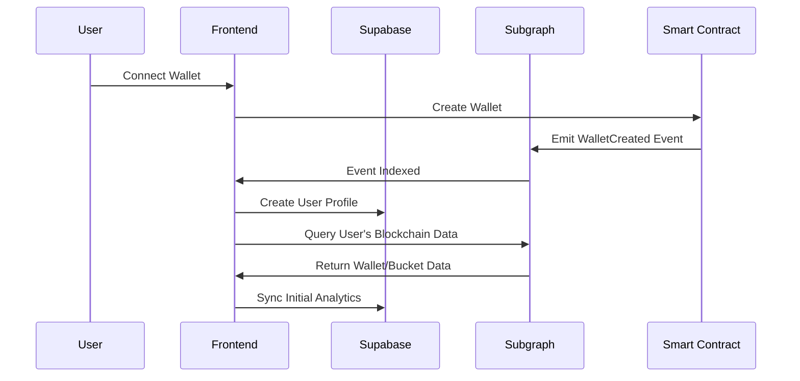
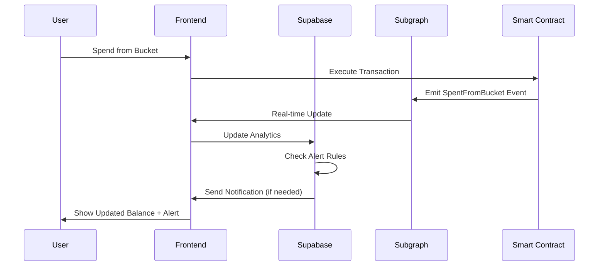

# Expendi Backend Integration Roadmap

## 🎯 Goals
- User management and profiles
- Advanced analytics and insights
- Push notifications and alerts
- Caching for performance
- Business logic not suitable for blockchain

## 🏗️ Architecture Components

### 1. Data Sources
- **Subgraph**: Real-time blockchain data (transactions, buckets, balances)
- **Supabase**: User profiles, preferences, analytics, notifications
- **Smart Contracts**: Source of truth for wallet operations

### 2. Integration Patterns
- **Frontend-driven sync**: Frontend coordinates between subgraph and Supabase
- **Event-driven sync**: Webhook/polling to sync subgraph data to Supabase
- **Hybrid queries**: Combine data from both sources

## 📋 Implementation Phases

### Phase 1: Basic User Management (Week 1-2)
1. **Supabase Setup**
   - Database schema creation
   - Authentication setup
   - Row Level Security (RLS) policies

2. **User Registration Flow**
   - Wallet connection triggers user creation
   - Sync wallet address with user profile
   - Store user preferences

### Phase 2: Event Synchronization (Week 3-4)
1. **Subgraph to Supabase Sync**
   - Real-time event processing
   - Data enrichment and analytics
   - Notification triggers

2. **Analytics Foundation**
   - User activity tracking
   - Spending pattern analysis
   - Budget performance metrics

### Phase 3: Advanced Features (Week 5-8)
1. **Notifications System**
   - Budget limit alerts
   - Monthly spending summaries
   - Smart insights

2. **Advanced Analytics**
   - Spending trends
   - Category insights
   - Predictive analysis

## 🗄️ Database Schema

### Users Table
```sql
CREATE TABLE users (
  id UUID PRIMARY KEY DEFAULT gen_random_uuid(),
  wallet_address TEXT UNIQUE NOT NULL,
  wallet_contract_address TEXT,
  email TEXT,
  username TEXT,
  avatar_url TEXT,
  timezone TEXT DEFAULT 'UTC',
  notification_preferences JSONB DEFAULT '{}',
  onboarding_completed BOOLEAN DEFAULT FALSE,
  created_at TIMESTAMP WITH TIME ZONE DEFAULT NOW(),
  updated_at TIMESTAMP WITH TIME ZONE DEFAULT NOW()
);
```

### User Analytics Table
```sql
CREATE TABLE user_analytics (
  id UUID PRIMARY KEY DEFAULT gen_random_uuid(),
  user_id UUID REFERENCES users(id) ON DELETE CASCADE,
  period_start DATE NOT NULL,
  period_end DATE NOT NULL,
  total_spent NUMERIC(36, 18) DEFAULT 0,
  total_deposited NUMERIC(36, 18) DEFAULT 0,
  buckets_count INTEGER DEFAULT 0,
  transactions_count INTEGER DEFAULT 0,
  most_used_bucket TEXT,
  spending_categories JSONB DEFAULT '{}',
  created_at TIMESTAMP WITH TIME ZONE DEFAULT NOW()
);
```

### Notifications Table
```sql
CREATE TABLE notifications (
  id UUID PRIMARY KEY DEFAULT gen_random_uuid(),
  user_id UUID REFERENCES users(id) ON DELETE CASCADE,
  type TEXT NOT NULL, -- 'budget_alert', 'monthly_summary', 'insight'
  title TEXT NOT NULL,
  message TEXT NOT NULL,
  data JSONB DEFAULT '{}',
  read BOOLEAN DEFAULT FALSE,
  sent_at TIMESTAMP WITH TIME ZONE,
  created_at TIMESTAMP WITH TIME ZONE DEFAULT NOW()
);
```

### Bucket Insights Table
```sql
CREATE TABLE bucket_insights (
  id UUID PRIMARY KEY DEFAULT gen_random_uuid(),
  user_id UUID REFERENCES users(id) ON DELETE CASCADE,
  bucket_name TEXT NOT NULL,
  month_year TEXT NOT NULL, -- 'YYYY-MM'
  budgeted_amount NUMERIC(36, 18),
  spent_amount NUMERIC(36, 18),
  remaining_amount NUMERIC(36, 18),
  utilization_percentage NUMERIC(5, 2),
  trend_vs_previous_month NUMERIC(5, 2),
  created_at TIMESTAMP WITH TIME ZONE DEFAULT NOW(),
  UNIQUE(user_id, bucket_name, month_year)
);
```

## 🔄 Integration Patterns

### Pattern 1: Frontend-Driven Sync
**When**: User connects wallet, creates bucket, makes transaction
```typescript
// Frontend flow
1. User connects wallet
2. Check if user exists in Supabase
3. If not, create user record
4. Query subgraph for user's blockchain data
5. Sync/update relevant data in Supabase
```

### Pattern 2: Event-Driven Sync
**When**: Real-time blockchain events need processing
```typescript
// Backend service flow
1. Poll/webhook from subgraph for new events
2. Process and enrich event data
3. Update Supabase analytics tables
4. Trigger notifications if needed
5. Cache computed insights
```

### Pattern 3: Hybrid Queries
**When**: Displaying dashboard with mixed data
```typescript
// Combined data fetching
1. Get user profile from Supabase
2. Get real-time balances from subgraph
3. Get analytics/insights from Supabase
4. Merge and present unified view
```

## 🚀 Quick Start Implementation

### 1. Supabase Project Setup
```bash
# Install Supabase CLI
npm install -g supabase

# Initialize project
supabase init

# Start local development
supabase start

# Create and run migrations
supabase migration new init_schema
```

### 2. Environment Variables
```env
# .env.local
NEXT_PUBLIC_SUPABASE_URL=your-supabase-url
NEXT_PUBLIC_SUPABASE_ANON_KEY=your-supabase-anon-key
SUPABASE_SERVICE_ROLE_KEY=your-service-role-key
NEXT_PUBLIC_SUBGRAPH_URL=https://api.studio.thegraph.com/query/75392/expendi/v0.1.1
```

### 3. Integration Service Architecture
```typescript
// services/integration.ts
class ExpendiBridgeService {
  async syncUserFromWallet(walletAddress: string) {
    // Check subgraph for user's wallet
    // Create/update user in Supabase
    // Sync initial data
  }

  async processNewTransaction(transactionData: any) {
    // Update analytics
    // Check for notification triggers
    // Cache insights
  }

  async generateMonthlyInsights(userId: string) {
    // Aggregate data from subgraph
    // Calculate trends and patterns
    // Store in analytics tables
  }
}
```

## 📊 Data Flow Examples

### User Registration Flow


### Transaction Processing Flow


## 🎯 Success Metrics
- **User Engagement**: DAU/MAU, session duration
- **Feature Adoption**: Bucket creation rate, notification click-through
- **Performance**: Query response times, sync lag
- **Reliability**: Uptime, data consistency between sources

## 🔄 Migration Strategy
1. **Parallel Development**: Build Supabase integration alongside existing frontend
2. **Gradual Rollout**: Start with user profiles, then analytics, then notifications
3. **Feature Flags**: Toggle between data sources during transition
4. **Data Validation**: Continuous monitoring of data consistency

## 🛠️ Tech Stack Recommendations
- **Backend**: Supabase (PostgreSQL + Edge Functions)
- **Real-time**: Supabase Realtime + Subgraph subscriptions
- **Notifications**: Supabase Edge Functions + Push API
- **Analytics**: Supabase + Custom aggregation functions
- **Caching**: Redis/Upstash for computed insights